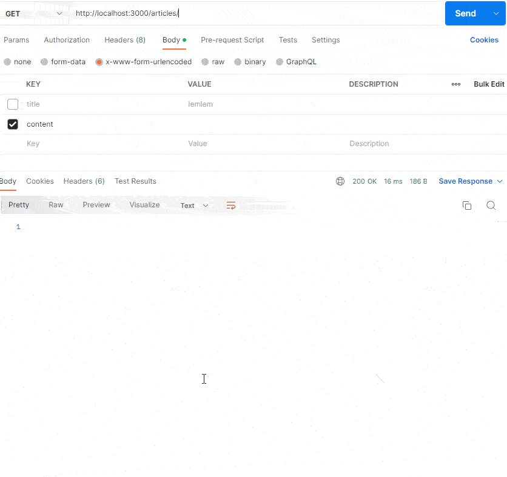

# wiki-REST_API-nodejs


<h3 align="left">Languages and Tools:</h3>
<p align="left">

<a href="https://developer.mozilla.org/en-US/docs/Web/JavaScript" target="_blank" rel="noreferrer">  </a>
<a href="https://developer.mozilla.org/en-US/docs/Web/JavaScript" target="_blank" rel="noreferrer">  </a> <a></a>
</p>


This is a simple frontend project which is built while learning full-stack web development by Dr.Angela yu the course is called  [The Complete 2022 Web Development Bootcamp](https://www.udemy.com/course/the-complete-web-development-bootcamp/) this is the best-seller course in web development on Udemy
### installtion
```npm i```
### Result

## In this project, I learn
- What is an API and What is a REST API 
- The 6 constraints of a REST Architecture
- How to make HTTP calls (GET, POST, PUT, DELETE, PATCH)
- API Security - Authentication & Authorization
- API Versioning & Deprecation Strategies 
- Error Handling 
- API Performance Optimization & Monitoring